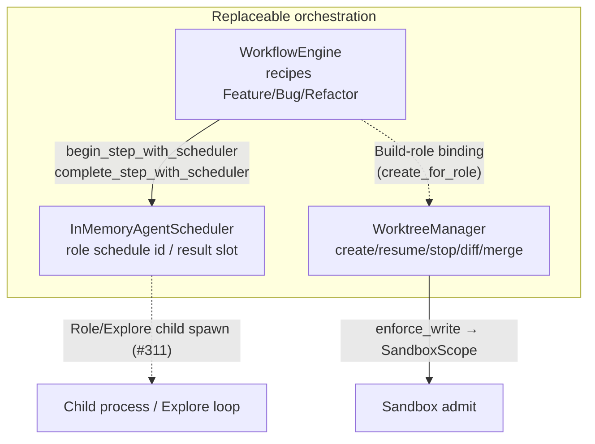
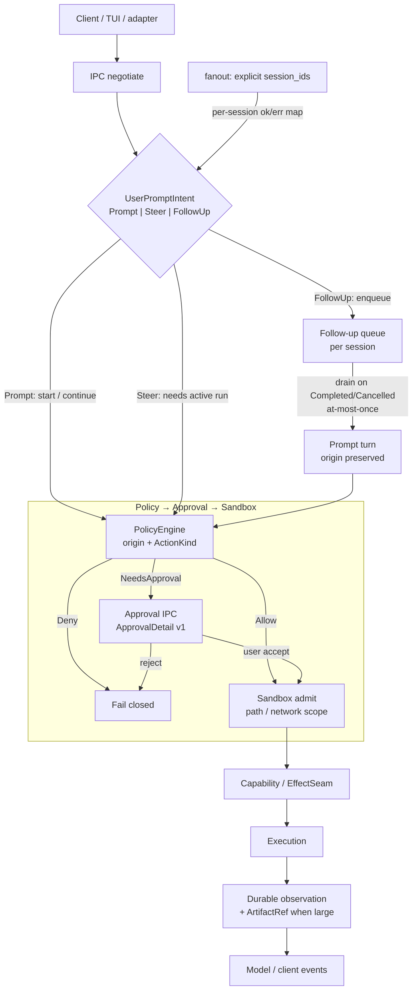

# Impetus Architecture

**Impetus** is a policy-centered local agent harness. The daemon (`impetusd`) owns
durable state; clients (`impetus`, TUI, adapters) send typed requests and render
events.

Code is the source of truth. Status labels below mean:

- **Implemented** — production path in `impetusd` / client with tests
- **Partial** — library or import path exists; not fully wired or incomplete
- **Planned** — roadmap only

## Core principles

- Durable events first: SQLite WAL event log, survive restart
- Policy-gated execution: every action goes through
  `Policy → Approval → Sandbox → Capability → Execution`
- Versioned Unix-domain IPC with capability negotiation
- Fail-closed admission: no execution when sandbox/policy denies
- Secrets only via Keychain references (macOS); never raw tokens in SQLite/logs
- **No root / sudo / password in normal mode:** userspace data dirs only;
  Seatbelt via `sandbox-exec`; Keychain resolve is silent
  (`kSecUseAuthenticationUISkip`) and fail-closed; RiskGate denies privilege
  escalation; PTY refuses login-shell argv (`-l` / `--login`)
- Trusted kernel stays small; providers, context, extensions are replaceable layers
- Reject features whose only justification is vendor parity or feature-count optics

## Trusted kernel

```text
EventStore + DurableArtifactStore + Policy + Approval + Sandbox + Executor
```

Replaceable layers above the kernel:

```text
ProviderProtocol → ContextEngine → ToolOrchestrator
  → AgentScheduler + WorkflowEngine + WorktreeManager
  → ExtensionGateway
```

### Orchestration stack (Next)

In-memory orchestration today — recipes, role schedule handles, and worktree
lifecycle. Not a live multi-process swarm.



Module links:

- [`workflow_engine.rs`](crates/impetus-core/src/workflow_engine.rs) —
  step order, budgets, retry stub, checkpoints; scheduler hooks on begin/complete
- [`agent_scheduler.rs`](crates/impetus-core/src/agent_scheduler.rs) —
  `InMemoryAgentScheduler` (#253)
- [`worktree_manager.rs`](crates/impetus-core/src/worktree_manager.rs) —
  durable ownership + Build-role sandbox binding
- Supporting: [`subagent_metadata.rs`](crates/impetus-core/src/subagent_metadata.rs),
  [`child_concurrency.rs`](crates/impetus-core/src/child_concurrency.rs),
  [`child_result_store.rs`](crates/impetus-core/src/child_result_store.rs),
  [`explore_child.rs`](crates/impetus-core/src/explore_child.rs) /
  [`explore_agent_loop.rs`](crates/impetus-core/src/explore_agent_loop.rs) (#306)

**Still Planned / open on this stack:** cross-machine orchestration. Research/Build/Review
role AgentLoop parity landed (#322) via `role_agent_loop` — not process stubs.

- **AgentScheduler** — schedules agent **roles** (Explore / Research / Build / Review)
  with structured metadata and concurrency caps. Role enum +
  [`ChildRunMetadata`](crates/impetus-core/src/subagent_metadata.rs) validation
  landed (#246); global child concurrency gate
  ([`ChildConcurrencyGate`](crates/impetus-core/src/child_concurrency.rs), default
  cap 4) landed (#251); durable
  [`ChildResultStore`](crates/impetus-core/src/child_result_store.rs)
  + parent-resume gate stub (#250, labels only); in-memory role scheduler wired into
  [`WorkflowEngine`](crates/impetus-core/src/workflow_engine.rs) step begin/complete
  ([`InMemoryAgentScheduler`](crates/impetus-core/src/agent_scheduler.rs), #253);
  Explore library + production `impetusd` `explore_spawn` (#306 / #308);
  WorkflowRuntime live role children (#311). Parent-log `Child*` lifecycle
  events (Started/Finished) Implemented (#315 / #318); mid-run action detail
  stream still thin.
- **WorkflowEngine** — small declarative recipes (feature/bug/refactor); owns step
  order, budgets, retry, checkpoints, cancellation, result propagation. Role-tagged
  steps record scheduler handles via `begin_step_with_scheduler` (#253). Recipe
  validation rejects self-deps and multi-node dependency cycles
  (`reject_dependency_cycles`, #296). Do not invent a new agent type per workflow.
- **WorktreeManager** — managed git worktree lifecycle (create/resume/stop/diff/
  merge-ready/conflict/stale/close/salvage) with durable ownership and restart
  recovery; Build-role bindings attach sandbox/write permissions to the isolated
  worktree (`create_for_role` + `enforce_write`). **Production daemon:**
  `impetusd` opens `{data_root}/worktrees.sqlite3` + `{data_root}/worktrees/`
  via `open_daemon_worktree_manager` → `Harness::with_worktree_manager`
  (fail-closed on open) so Git IPC session cwd prefers managed bindings.
- **ToolOrchestrator** — JSON Schema arg validation (`tool_schema`) before
  policy/sandbox/exec; OpenAI/Anthropic HTTP requests include `tools` from
  `builtin_tool_schemas()`.
- **Hook prefilter** — cheap in-process label match
  ([`hook_prefilter`](crates/impetus-core/src/hook_prefilter.rs), #257/#272/#276)
  (`AllowContinue` / `SkipSpawn` / `Deny`); rules carry `HookTrustLevel`
  (`InDaemon` / `External`); security-critical patterns require InDaemon —
  External matcher for those → clear Deny/error; catalog `try_new`/`add_rule`
  refuse exact duplicates (same pattern + action) with conflicting rule ids in
  the error — pattern subsumption YAGNI. **Implemented** on live
  `ProcessExecutionRequest::execute` (always calls `spawn_stub` before OS spawn;
  empty default catalog or `with_hook_prefilter` inject). Performance hook only —
  not RiskGate. **Production daemon:** `impetusd` autoloads
  `$IMPETUS_DATA_DIR/hooks.json` and/or `hooks/*.json` into Harness →
  ToolOrchestrator → `ProcessExecutionRequest` (fail closed on bad config).
  Full hook/plugin ABI still Planned.
- **Built-in id hygiene** — small shipped inventory + duplicate detect
  ([`builtin_ids`](crates/impetus-core/src/builtin_ids.rs), #260); doctor
  `builtin_ids` probe; unused cross-ref stub Planned. No marketplace / vendor
  parity sprawl.

Security decisions stay in the kernel, not in ordinary plugins.

## Process topology

```text
impetus / impetus-tui / adapters
        │  versioned Unix socket (HarnessClient)
        ▼
impetusd  — authoritative daemon
  Harness (policy kernel)
  AgentLoop + ToolOrchestrator
  ProviderRegistry
  EventStore (SQLite WAL) + DurableArtifactStore
  Keychain credential resolver (macOS)
```

## Capability matrix (current)

| Area | Status | Evidence |
| --- | --- | --- |
| Durable EventStore + reconnect cursor | Implemented | `storage.rs` `list_after` + COUNT head for `append_next`; IPC Stream/Subscribe; agent Chunk coalesce (`AGENT_CHUNK_COALESCE_BYTES`) + spill over `MAX_AGENT_CHUNK_EVENT_BYTES` → DurableArtifactStore (preview + ArtifactRef); Stream/Subscribe `Events` batches trimmed to `IPC_EVENTS_FRAME_BUDGET` (≤60 KiB under `MAX_IPC_LINE_BYTES`); Criterion baselines in `benches/event_log.rs` + `docs/benchmarks/event-log-v0.2.md` (#16) |
| Policy `Deny \| Allow \| NeedsApproval` + origin | Implemented | `policy.rs`, `tool_orchestrator.rs` |
| PolicyConfig JSON load / reload | Implemented | **Startup load** in `impetusd` (`--policy-config` / env / `policy.json`). **IPC** `ReloadPolicyConfig` (`reload_policy_config` capability) applies live overrides without daemon restart; invalid reload keeps prior policy + audit Notice. Library `AgentRuntime::reload_policy_config*`. Soft `Allow` skips RiskGate `NeedsHuman`; hard Deny (path/network/sandbox + RiskGate Deny e.g. sudo) still wins (`effects` / `policy` tests). **Risk:** in-flight `AgentLoop` keeps a PolicyEngine clone — mid-run reload applies on next Prompt only (`mid_run_policy_clone_ignores_later_reload`). |
| Workspace Files (list/stat/read/search) | Implemented | **IPC v8+** `ListWorkspaceDir` / `StatWorkspaceFile` / `ReadWorkspaceFile` / `SearchWorkspaceFiles` + caps `workspace_*`; `workspace_files.rs` path resolve matches `memory_store` (no `..` / absolute / symlink escape); reject huge + binary; ignore `.git`/`target`/`node_modules`. TUI `Ctrl+F` / `/files` + `/` daemon search + name filter + 500-entry dir cap. Desktop FileTree list/read/search via harness (no local walk). |
| Git (repo/branches/status/diff) | Implemented | **IPC v12** `git` + `structured_diff`; `GetRepositoryState` / `ListBranches` / `GetCurrentBranch` / `CreateBranch` / `SwitchBranch` / `GitStatus` / `ListChangedFiles` / `GetDiff` / `GetFileDiff` (`GitDiffPayload.patch` + optional `observation` hunks via `diff_observation`; wire gate for GetDiff/GetFileDiff is `git`; `structured_diff` advertises DiffObservation enrichment; WorktreeManager numstat counts overlay when `base_ref` + binding); `git_ops.rs` via system git (`status --porcelain=v1 -z`; dirty/conflict/stale refuse); session cwd prefers daemon `WorktreeManager` (`impetusd` opens `{data_root}/worktrees.sqlite3` + `worktrees/`, fail-closed; `switch_bound_branch` updates persisted `binding.branch`). TUI `Ctrl+B` branch picker. Desktop BranchSelect via harness (no local git). |
| Path-scope sandbox (workspace FS) fail-closed | Implemented | `effects.rs`, `tests/sandbox_fail_closed.rs` |
| Daemon-owned PTY (`portable-pty`) | Implemented | IPC v12 Pty* (`session_id` required; `PtySession.owner_session_id`); cross-session deny; events → owner only; cwd containment; User vs Agent (Agent → `prepare_pty_sandbox` on macOS); ring + coalesce spill; TUI passthrough. **Durable store:** `impetusd` attaches `SqlitePtySessionStore` at `$IMPETUS_DATA_DIR/pty_sessions.sqlite3` when open succeeds — metadata survives restart; live PTY handles do not (client must re-`PtyStart`). On `set_store`, formerly-live rows → `Failed` (stale handle), `next_id` advances past max durable id (no reuse). |
| macOS Seatbelt (`sandbox-exec`) in tool/process exec | Implemented | Wired: `execution/sandbox.rs` + macOS path in `execution/process.rs`; Agent-origin PTY uses `prepare_pty_sandbox` (same profile rules). User-origin PTY = cwd containment only. Non-macOS stays path-scope only (`tests/macos_sandbox_production.rs`). |
| Linux / Windows sandbox backends | Planned | Phase 9; PR CI: macOS clippy/tests (`--lib --bins`) + Linux fmt + `cargo check` |
| Keychain API-key references (macOS) | Implemented | `impetusd` `MacosKeychainResolver` (lazy on `--provider-profile` prompt). Silent ItemSearchOptions + `kSecUseAuthenticationUISkip` — never unlock/password UI. Default daemon / CI use `NoCredentialResolver`. `CI` / `IMPETUS_NONINTERACTIVE` skip Keychain entirely (#308 / #320). |
| Privilege boundaries (no sudo/password) | Implemented | `privilege_boundaries` + RiskGate Deny on sudo/doas; PTY admit refuses `-l`/`--login`; runtime paths under `$HOME` / `IMPETUS_DATA_DIR`; Seatbelt userspace-only (#320). |
| Execution modes (ASK/PLAN/ACCEPT_EDITS/AUTO) | Implemented | Daemon IPC `Set`/`Get` + durable projection + EffectSeam mode gate + RiskGate (#308). TUI Shift+Tab/F4/slash via IPC; `prompt_prefix` removed. BYPASS opt-in only (not Shift+Tab cycle). |
| DurableArtifactStore (SHA-256, restart-safe) | Implemented | `durable_artifacts.rs`; tools/web/upload/read IPC; optional MIME; prod age GC 7d (`run_artifact_gc`, `impetusd` startup+6h; age-only, no ref-tracking); TUI `/attach` · `Ctrl+Shift+A` filesystem upload → ArtifactRef in composer |
| Ephemeral AttachmentStore (approvals/diffs) | Implemented | `attachments.rs` — session-bound `GetAttachment` (owner ok / foreign deny / missing+expired); TUI fetch via session id; intentional, not durable |
| Process stdout/stderr → durable artifacts | Implemented | process exec stores large bodies; preview + `ArtifactRef` |
| AgentLoop vertical (read + approval write/shell) | Implemented | `agent_loop.rs`, `v05_gate` / orchestrator tests |
| Native OpenAI Chat Completions tool-call SSE | Implemented | `openai_provider.rs` + `OpenAiNativeAdapter`; `impetusd --provider-profile` |
| Native Anthropic Messages tool-call SSE | Partial | `anthropic_provider.rs` exported; not default daemon path |
| OpenAI Responses API | Partial | Opt-in `openai_http_api=responses` SSE subset; not production default |
| Legacy OpenAI-compatible text stream | Implemented | `openai_compat_adapter.rs` (still in tree; not default); `GET /v1/models` discovery on ListModels; parse optional metadata into catalog when present; id-only → honest empty reasoning_efforts / capabilities (never invent low/medium/high) (#322) |
| Session model override → HTTP stream | Implemented | `SetSessionModel` → durable `$IMPETUS_DATA_DIR/session_models/{uuid}.json` + RAM cache → `StreamOptions`; reasoning validated against **selected model** advertised efforts (free-form; no global enum). Load/prompt/**RAM-hit**/FollowUp/approval-resume revalidate fail-closed (invalid RAM entry dropped; no silent default after restart) (#322) |
| ACP agent capability snapshot (vendor-neutral) | Implemented | `AgentCapabilitySnapshot` on `ModelProviderStatus` (no `codex_*` IPC fields); cached from ACP initialize + `session/new` config_options. `discover_models` / `advertised_reasoning_efforts` use agent `model_ids` / `thought_levels` as SoT; **never invent** `capabilities.tools=true` (default false; `reasoning` only when `thought_levels` non-empty) (#322). `session/set_config_option` before prompt. |
| JSON Schema tool-arg validation (before policy) | Implemented | `tool_schema.rs` + ToolOrchestrator gate |
| Provider HTTP `tools` field | Implemented | OpenAI + Anthropic from `builtin_tool_schemas()` |
| Measured usage → budget accounting | Implemented | `record_turn_with_usage` in agent loop |
| Context HOT/WARM/COLD + lazy descriptions | Implemented | `context_optimizer.rs`, wired in `harness_api` |
| ContextBuilder (chunked artifact summarize) | Implemented | `context_builder.rs` |
| Auto durable compaction (threshold → events) | Implemented | Agent loop calls `run_durable_compaction` (deterministic fold + durable budget events; **not** LLM summarizer) |
| Auto LLM compaction as durable events | Planned | Model-authored summaries still open |
| Session shared-prefix fork + checkpoints | Implemented | `storage.rs`, IPC fork/checkpoint |
| Extension **import** adapters (Skills/MCP/Claude/Codex/Cursor/Plugins) | Implemented | `*_adapter.rs` + unit tests |
| Extension **runtime** MCP / skills in agent loop | Partial | **MCP live:** `$IMPETUS_DATA_DIR/mcp/*.json` → AgentLoop (`mcp_manage`). **Skills:** workspace `.impetus/skills` + Active `ExtensionHost` / migrated legacy via `effective_skill_roots` (package host shadows legacy on same skill key) → Context/Prompt/FollowUp. **Package host (#324/#329):** SDK + host + IPC `extension_manage` (v14) + durable disable + permission→Policy + `mcp_bridge`↔MCP SoT + `host_process` spawn/handshake/`operate`/`cancel` (request id, timeout, payload limits, secret-key reject, manifest permission gate, crash cleanup) + `daemon_unix_extensions` (skill lifecycle + host-process-echo fixture). **SoT unify (#330):** daemon-owned effective inventory + CLI `--data-dir`/`migrate`; no duplicate MCP/Skill activation. **Remaining:** crates.io SDK publish; IPC wrap for operate. |
| Module Runtime foundation | Partial | Library + tests; not the live `impetusd` control plane |
| Explore child (production daemon) | Implemented | `ExploreChildRunner` + `AgentLoopExploreExecutor` → restricted AgentLoop → `ChildResultStore` → parent-resume (`Harness::spawn_explore` / `complete_explore_and_gate`). **Production daemon:** `impetusd` wires one AgentLoop Explore executor for both `explore_spawn` and Workflow Explore steps (#320). Parent-log `Child*` Started/Finished (#315/#318). TUI `/children` + Activity fold + IPC `ListChildRuns` (#311). |
| `hook_prefilter` on process spawn | Implemented | Live on `ProcessExecutionRequest::execute` (`spawn_stub` before OS spawn). **Production daemon:** autoload from `$IMPETUS_DATA_DIR/hooks.json` / `hooks/*.json` via `wire_daemon_runtime` → Harness → ToolOrchestrator. Not RiskGate. |
| `SteerRewrite` (live provider) | Implemented | `ProviderSteerRewrite` one-shot via default `ModelProvider`; daemon `with_provider_steer_rewrite`; passthrough fallback offline (#285 / #311). |
| Auto `RiskGate` (post-policy, mode-aware) | Implemented | `DeterministicRiskGate` in `EffectSeam`; all `AgentRuntime::request_action` via seam; process argv; tool_orchestrator; remote/PTY helpers use `with_sandbox` (Ask + RiskGate). Separate from `hook_prefilter`. Soft PolicyConfig `Allow` skips `NeedsHumanApproval` only — RiskGate hard `Deny` still wins. |
| Web search/fetch + SSRF egress | Implemented | `web_research/` |
| Optional API search (Tavily/Exa) | Implemented | `HttpApiSearchBackend` + `ApiKeyResolver` (Keychain labels); absent key fail-closed; seam module retained (#264 / #311). |
| Session web outbound / private-network grants | Implemented | `SandboxScope.allow_web_outbound`, `allow_private_network` |
| Browser provider | Partial | Daemon IPC `GetBrowserHealth` / `NegotiateBrowser` honest Absent (compatible=false). Library Mock/Absent + Firefox/Chrome identity modules. Extension-first (#336): concrete CDP/WebDriver **Parked** under `BrowserIntegration` — not core. |
| Coding tools (definition/refs/diagnostics/symbols/hover/cancel) | Partial | Seam + IPC `coding_definition` / `coding_hover` / `coding_diagnostics` / `coding_symbols` / `coding_cancel` (#336). **`impetusd` wires `ProcessLspBackend`** (generic stdio) when `IMPETUS_LSP_BINARY` or `rust-analyzer` on PATH. Absent binary → Unavailable (honest). Crash respawn + Drop + `$/cancelRequest` + publishDiagnostics cache + documentSymbol shipped. Extension-first: language packs via `LspIntegration`; full LSP protocol Parked. |
| Subagents / WorktreeManager / WorkflowEngine | Implemented | `WorkflowRuntime` live spawn; Research/Build/Review via `AgentLoopRoleExecutor` (same AgentLoop bridge as Explore — **no** `git status --short` stubs) (#322); Failed child → `fail_step` (not fake Completed); Cancelled → `cancel_with_scheduler`; `cancel_session` best-effort worktree stop/close; fair per-parent caps; Cancel/CancelWorkflow. **WorktreeManager** in `impetusd`; `ListWorktrees` without `session_id` → global non-closed catalog (#322). |
| Extension lifecycle (plan/apply/ownership/enable/disable/unload/doctor/repair) | Implemented | CLI control plane: `extension plan|install|remove|enable|disable|unload|list|migrate|doctor|repair` + durable status (`{path}.disabled`). Daemon SoT under `$IMPETUS_DATA_DIR` (`extensions/install_state.db`, `extensions/legacy_skills/`, `mcp/`); `--root` keeps workspace `.impetus/` layout. Effective inventory merges package host + MCP SoT + legacy (shadow losers). IPC `ListExtensions` / `GetExtensionStatus` (`extension_runtime`). **Package SDK (#324/#329):** `impetus-extension-sdk` + host_process protocol (`operate`/`cancel`) + `ExtensionCapabilityRegistry` + IPC `extension_manage` + durable disable + permission→Policy + `mcp_bridge`↔MCP SoT. Allowlist `#296`. Not marketplace (Won't). |
| MemoryStore (contextual knowledge) | Implemented | Daemon control-plane IPC List/Get/Append/Clear/Export + JSONL under `$IMPETUS_DATA_DIR/memory/` (`memory` / `memory_manage`). AgentLoop Prompt/FollowUp/approval-resume injects project-scoped session entries as a bounded system context block (`SessionMemoryRuntime::prompt_context_block` → `inject_memory_context`); empty store = no-op. |
| PolicyStore (governed instructions) | Implemented | `policy_store.rs` + daemon autoload; IPC `GetPolicyStore`/`ReloadPolicyStore`; CLI `impetus-cli policy …` (#311). Distinct from PolicyConfig. |
| Versioned canonical schemas (`impetus.*.v1`) | Implemented | Shared `schema` registry: `approval_detail` + `capabilities` + `extension` + `session` + `mcp`. Mutating validate-on-wire: daemon rejects bad PolicyConfig/PolicyStore JSON, empty mutating ids, SetSessionModel labels, MCP `env_keys` KEY=value; ApprovalDetail responses run version + full envelope. Client unix retains negotiated caps/version and gates optional calls. Adjacent-version + unsupported-cap tests (#331). `IPC_VERSION` unchanged (14). |
| ACP as ModelProvider backend | Implemented | `--acp-profile` + gateway V2 + `AcpAdapter`; tool/status → `StreamEvent`; disconnect → `InterruptedUnknown` (never false `Completed`); registry/health/redaction (#335 / #66). Live smoke Partial. |
| TUI (`impetus ui`) | Partial | Shell, composer, paste + filesystem attach (`/attach` · `Ctrl+Shift+A`), streaming; Prompt/Steer/FollowUp; execution modes; **model picker** F8/`/model` via `ListProviders`/`SetSessionModel` (Provider→Model→Reasoning→catalog options; unavailable disabled; restore after reconnect; options local until #328) (#337); `/children`; Files `Ctrl+F`; git branch `Ctrl+B`; Review F6/`Ctrl+R`/`/review`; Activity fold; PTY `Ctrl+\` passthrough; fork `/fork`+`Ctrl+Shift+K` / checkpoints F7/`/checkpoint` / workspace path prompt on `/new` (#311/#315). Remaining: sequence picker polish. |
| Zap as Impetus backend | Partial | Experimental `impetus-zap-adapter`; see § Zap path (#5) |
| PR CI critical security E2E suite | Partial | Path-aware PR: macOS clippy/`--lib --bins`; Linux fmt + `cargo check`; heavy `crates/*/tests/` = local/`task verify` |

## IPC compatibility (PROTO)

- `IPC_VERSION` = 14, `IPC_MIN_SUPPORTED` = 12. **Hello negotiation:** client
  sends preferred `version` (max) and optional `min_version` (legacy omit →
  exact). Server selects highest overlap with `[IPC_MIN_SUPPORTED, IPC_VERSION]`
  and returns that version; empty overlap → `Incompatible` with
  `min_supported` + `supported_version` + upgrade hint. Cap intersection after
  version selection unchanged. **Per-connection freeze:** first successful Hello
  locks negotiated caps + version; subsequent Hello on the same connection
  echoes the frozen set (no privilege widen). Adjacent-version tests cover
  v12-only clients (`negotiate_ipc_version` + daemon wire Hello). Unsupported
  capability → `Unavailable` (daemon + client unix local gate). Mutating
  request/response validate-on-wire before dispatch / after handle (#331).
- Presentation crates import wire/event DTOs from
  `impetus-client::protocol` (façade over `impetus-protocol`). Do not depend on
  `impetus-core` from TUI/Desktop for **types**.
- Optional Cargo feature `impetus-client/in-memory` gates
  `InMemoryTransport` and pulls optional `impetus-core`; Unix socket remains the
  default production path (no core dep).
- Wire DTOs live in runtime-free `impetus-protocol` (no rusqlite/reqwest/Harness).
- **PTY (v12):** every `Pty*` request carries `session_id`; `PtySession`
  response includes `owner_session_id`. Cross-session ops denied; lifecycle/
  output/spill events route only to the owner session (no first-session
  fallback). Cwd must resolve inside workspace (`resolve_pty_working_dir`).
  User origin = containment only; Agent origin = macOS Seatbelt via
  `prepare_pty_sandbox`. Spill: coalesce + `MAX_PTY_PENDING_SPILLS=4`.
- Bump `IPC_VERSION` when adding Git / Files / PTY / MCP-model catalog /
  rich activity capabilities to Hello. Current caps include workspace Files,
  Git, `structured_diff` (advertises DiffObservation enrichment on
  GetDiff/GetFileDiff; wire gate for those methods is `git`), daemon-owned
  `pty`, read-only `list_mcp` / `list_models`, and additive `artifact_read`
  (Read/GetMetadata/Range; MIME on upload). First successful Hello freezes
  negotiated caps + version for the connection; re-Hello echoes the frozen
  set and must not widen (e.g. `approval_scope_full_auto`).

## Request path

Typed intent routes first; mutating work still hits the kernel gate. Intent
routing never rewrites `origin` or skips Policy.



Module links:

- [`user_intent.rs`](crates/impetus-core/src/user_intent.rs) —
  `UserPromptIntent`, `UserIntentRouter`, follow-up drain, `fanout`
- [`steer_rewrite.rs`](crates/impetus-core/src/steer_rewrite.rs) —
  `SteerRewrite` seam — **Implemented** live `ProviderSteerRewrite` via default
  provider (`with_provider_steer_rewrite` in daemon; passthrough offline)
- [`policy.rs`](crates/impetus-core/src/policy.rs) —
  `PolicyEngine` / `PolicyDecision` (`Deny` | `Allow` | `NeedsApproval`)
- [`policy_config.rs`](crates/impetus-core/src/policy_config.rs) —
  JSON load + IPC `ReloadPolicyConfig` — **Implemented** (see matrix)
- [`approval.rs`](crates/impetus-core/src/approval.rs) —
  `ApprovalDetail` IPC UI contract (`impetus.approval_detail.v1`)

Steer targets an active run; FollowUp enqueues after the current turn. In-memory
router lives in `user_intent`; IPC `Prompt.intent` + durable `IntentEvent.intent`
and TUI `/prompt`·`/steer`·`/follow-up` are wired (#263). On session-run
Completed/Cancelled, harness drains one queued FollowUp into a Prompt turn
(origin preserved; at-most-once vs cancel race) (#271). Multi-session fanout
takes an explicit `session_ids` list through `UserIntentRouter::fanout` (#275) —
empty list rejected; each target routes independently with a per-session ok/err
map (not broadcast-by-accident; no cross-machine). Live SteerRewrite on accept
is Implemented (#285 / #311).

**Still Planned / open on this path:** fanout over IPC / cross-machine.
(Daemon-owned execution modes + RiskGate + live SteerRewrite + WorkflowRuntime
cancel/replace are Implemented — see matrix.)

## Storage

| Store | Durability | Use |
| --- | --- | --- |
| EventStore (SQLite WAL) | Durable | Ordered session history, approvals, budgets |
| DurableArtifactStore | Durable | Large tool/web/paste bodies (SHA-256) |
| AttachmentStore | Ephemeral (RAM) | Approval diff previews / detail DTOs; reads require owning `session_id` |

Do not call AttachmentStore an ArtifactStore. Doctor must describe both honestly.

## Providers (truth)

Production daemon defaults to Mock, or `--provider-profile` → **native** OpenAI
Chat Completions SSE (`OpenAiProvider` + Keychain resolver) with tool-call
assembly. Legacy text-only OpenAI-compatible adapter remains in-tree for
compatibility but is not the default daemon wiring. Anthropic Messages parser
is exported. Responses API is Partial (opt-in profile field
`openai_http_api=responses`; Chat Completions stays default).

Target shape:

```text
ProviderProtocolAdapter → StreamEvent → ToolCall assembler
  → JSON Schema validation → Policy Kernel → execution
```

## Security model

1. Origin tracking: `origin=user|agent`
2. Policy before execution
3. Fail-closed sandbox admission (path scope today)
4. Keychain references only; redaction in logs/events
5. Typed approvals for mutating/sensitive ops
6. `UnknownOutcome`: no auto-retry of mutating/non-replayable work on alternate backends

## Policy customization and approval UI contracts (#9)

Classic issue #9: user **PolicyConfig** (JSON overrides) plus the versioned
**ApprovalDetail** IPC UI contract. This section indexes what exists; it does
not invent new runtime or change PolicyEngine semantics.

### PolicyConfig (format + load / reload)

JSON overrides on top of fail-closed defaults
([`policy_config.rs`](crates/impetus-core/src/policy_config.rs)):

- Document field: `version` must equal `POLICY_CONFIG_VERSION` (currently `1`)
- Optional `overrides`: map of `ActionKind` (serde snake_case) →
  `allow` | `deny` | `needs_approval`
- Parse / load: `PolicyConfig::parse`, `PolicyConfig::load_from_path`
- Apply: `PolicyEngine::with_config`, `reload_config`, `reload_config_from_path`
  (failed path reload keeps prior overrides)
- Runtime wrappers: `AgentRuntime::reload_policy_config` /
  `reload_policy_config_from_path`
- Fail-closed Denies (workspace path scope, network disabled, private-web hard
  denies) stay **ahead** of overrides — config cannot soften them
- Soft override `allow` is authoritative vs RiskGate `NeedsHumanApproval` only;
  RiskGate hard `Deny` (sudo / destructive) and sandbox path/network still win
- Mid-run: `AgentLoop` / `ToolOrchestrator` hold a PolicyEngine **clone**;
  `ReloadPolicyConfig` updates harness live policy — in-flight Prompt keeps
  pre-reload clone until next Prompt (same for PTY seam snapshot; see harness
  `ponytail` note). Upgrade path: shared `Arc` policy inside EffectSeam.
- Secrets: none in the format or fixed decision reason strings

Example:

```json
{
  "version": 1,
  "overrides": {
    "write_file": "allow",
    "spawn_process": "deny",
    "network_connect": "needs_approval"
  }
}
```

Not a shared `impetus.*.v1` registry schema today (separate `version: u32`).
Shipped under #9: format (#193), in-process reload (#201).

### ApprovalDetail IPC UI contract

`GetApprovalDetail` / `IpcResponse::ApprovalDetail` returns
[`ApprovalDetail`](crates/impetus-core/src/approval.rs) for client presentation
(diff preview, optional `diff_observation` hunks, affected paths, scope
estimate, attachment refs). This is a **versioned UI contract**, not a user
policy file format:

- Schema id: `impetus.approval_detail.v1`
  (`APPROVAL_DETAIL_SCHEMA_ID` / registry `SCHEMA_APPROVAL_DETAIL`)
- Payload field: `schema_version` (u16, currently `1`; omitted JSON defaults
  to v1 for backward compatibility)
- Capability: `get_approval_detail` (Hello negotiation)
- Secrets never appear in the payload — only labels/paths/opaque attachment
  UUIDs
- TUI rendering: `Overlay::Approval` / `ApprovalDetail` in `impetus-tui` (#165);
  structured `diff_observation` preferred over unified `diff_preview` when
  present (`render_approval_diff`)

Shipped under #9: contract (#189/#191), TUI approval UI (#165/#169).

### Remaining gaps for #9

Honest list (no new runtime in this docs slice):

- Operator UX to hot-reload PolicyConfig beyond typed IPC (file watcher / CLI sugar)
- Operator UX to edit/customize policy (out of scope for harness UI rewrite)
- Optional: register PolicyConfig in the shared `impetus.*.v1` schema registry
- Non-TUI clients (Zap adapter and others) consuming ApprovalDetail beyond the
  TUI overlay
- `PolicyStore` (governed instruction refs) is a **different** surface from
  PolicyConfig action overrides — see capability matrix row; operator UX still open

Docs index for the shipped contracts: this section (#286).

## Zap path vs standalone CLI/TUI (#5)

Classic issue #5: standalone CLI/TUI and Zap integration. This section indexes
honest client paths and what `impetus-zap-adapter` does today. It does not ship
a production Zap protocol or copy Zap/Warp client internals into the harness.

### Client paths

| Path | Role | Status |
| --- | --- | --- |
| CLI (`impetus`) | Primary user-facing commands via `HarnessClient` | Implemented (surface still growing) |
| CLI (`impetus-cli`) | Legacy/secondary; keep for existing workflows; migrate toward `impetus` | Implemented (do not delete) |
| Standalone TUI (`impetus ui` / `impetus-tui`) | First-class Ratatui client; ANSI/scrollback stay client-side; PTY = pass-through only (`Ctrl+\` / `/pty`, detach `Ctrl+]`); Files/Git/Review/Activity/fork/checkpoint/attach over harness IPC | Partial — polish |
| Zap | Zap owns UI; Impetus is agent backend after connect/authorize | Partial — experimental adapter only |

Boundaries (see [AGENTS.md](AGENTS.md)):

- Zap uses its own UI; structured integration is a **separate** adapter or
  personal fork — not harness core
- Do **not** copy Zap/Warp client internals (renderer, tabs, PTY/ANSI emulator)
  into `impetus-core` / `impetusd`
- OSC / notification hooks do **not** replace the typed versioned IPC protocol
- No local HTTP UI, Electron/WebView, or Node runtime in the harness
- Client disconnect must not destroy durable sessions or report unknown work as
  `Completed`

### `impetus-zap-adapter` checklist

Crate: [`crates/impetus-zap-adapter`](crates/impetus-zap-adapter). Historical /
experimental baseline that talks to `impetusd` over the Unix socket and renders
to stdout for a Zap-like terminal host.

| Piece | Status | Evidence / notes |
| --- | --- | --- |
| Unix-socket connect (`IMPETUS_SOCKET` or default data-dir sock) | Partial | `main.rs` — connect path only; no discovery service |
| `CreateSession` + `Prompt` + event `Stream` | Partial | `create_and_attach` / `stream_session` via transport requests |
| Typed transport (`UnixSocketTransport`) | Partial | Uses `impetus-client`; also imports `impetus-core` wire DTOs directly (boundary debt) |
| Structured Blocks (diff / approval / output / attachment / status / error) | Partial | `blocks.rs` — stdout / JSON helpers; not a production Zap wire protocol |
| OSC notification hooks (777 / 9 / 0) | Partial | `osc.rs` — terminal hooks only; not typed IPC |
| Live session status bar via OSC | Partial | `status_bar.rs` — Running / Idle / NeedsApproval hints |
| Capability negotiation / Hello / `Incompatible` handling | Planned | Not implemented in adapter |
| Zap discovery / Connect / Authorize production protocol | Planned | Classic #5 remaining; listed under Later in [TODO.md](TODO.md) |
| Bidirectional interactive approvals from Zap UI | Planned | Adapter TODO; approvals are render-only today |
| Consume `impetus.approval_detail.v1` as non-TUI client | Planned | Gap under § Policy customization (#9) |
| Embed Zap/Warp renderer or PTY emulator in harness | Out of scope | Client concern; AGENTS.md immovable boundary |

Labels mean the same as the capability matrix: **Implemented** / **Partial** /
**Planned**. Do not mark discovery/authorize or production Zap protocol as
Completed.

### Out of scope (this docs slice)

- Full Zap production discovery/authorize/backend handoff code
- Electron / HTTP UI inside the harness
- ACP production hardening checklist (separate issue)

Docs index for Zap honesty: this section (#290).

## ACP production hardening checklist (#66)

Classic issue #66: production-ready ACP path for external coding agents via the
official Rust SDK. This section indexes honesty only — no new runtime in this
docs slice (#294).

**Boundary (AGENTS.md):** ACP is the protocol between Impetus and an external
coding-agent CLI, not a universal provider API and not authorization storage.
Agent owns login; Impetus owns Policy, durable session, and orchestration.
`agent-client-protocol = 2.x` is the **SDK crate major**. Initialize uses
stable ACP **protocol v1** (`ProtocolVersion::V1`). Draft ACP protocol v2
features are **out of scope** until a separate RFC and compatibility tests
exist — do not enable them because the SDK crate is 2.x.

### Current path

```text
impetusd --acp-profile PATH
  → AcpProfile (agent-owned auth only)
  → AcpAgentConfig (command + args + scrubbed env: blank control-plane /
       secret names, `IMPETUS_ACP_CHILD=1`; SDK inherits parent and has no
       `env_clear`)
  → Harness::with_acp_gateway
  → AcpAdapter (ModelProvider)
  → AcpGatewayV2 (official SDK: initialize → authenticate → session/new
       → prompt → session/update stream → request_permission → cancel)
```

Pointers:

- Crate: [`crates/impetus-acp-gateway`](crates/impetus-acp-gateway/)
  (`gateway_v2.rs`, `profile.rs`, `registry.rs`, `health.rs`, `redact.rs`;
  legacy custom JSON-RPC `gateway.rs` quarantined — module import only, not
  crate-root / production selection)
- Adapter: [`crates/impetus-core/src/acp_adapter.rs`](crates/impetus-core/src/acp_adapter.rs)
- Daemon flag: `impetusd --acp-profile PATH` in
  [`crates/impetusd/src/main.rs`](crates/impetusd/src/main.rs)
- Deterministic (no secrets / no external binary): unit tests in
  `gateway_v2.rs` + `profile.rs` + `registry.rs` + `redact.rs` + `health.rs`; crate tests
  [`tests/deterministic_mock_test.rs`](crates/impetus-acp-gateway/tests/deterministic_mock_test.rs)
- Live smoke (ignored, needs installed agent + agent-owned creds):
  [`tests/acp_v2_smoke.rs`](crates/impetus-acp-gateway/tests/acp_v2_smoke.rs)
- Manual mock binary notes: [`TESTING.md`](crates/impetus-acp-gateway/TESTING.md)

### Checklist: Implemented vs Partial vs Planned

| Item | Status | Evidence / gap |
| --- | --- | --- |
| Official SDK primitives (`AcpAgent`, `Client`, `ConnectionTo`, `AcpAgentConfig`) | Implemented | `AcpGatewayV2` on `agent-client-protocol` 2.0.0 |
| Stable ACP protocol v1 initialize | Implemented | `InitializeRequest::new(ProtocolVersion::V1)` |
| Profile: absolute `command` + `args` + allow-listed non-secret `env` | Implemented | `AcpProfile::validate` / `to_agent_config` |
| Agent-owned auth only (no Keychain/OAuth/raw token on ACP profile) | Implemented | `CredentialStrategy::AgentOwned` required; secret env names rejected |
| ResolveApproval connection bind | Implemented | Daemon mints per-`serve_client` id; **CreateSession always binds**. Attach / Fork / Restore bind only if unbound or same connection — **Attach does not steal**. Foreign `ResolveApproval` → `Unavailable` (cap `resolve_approval_bound`). Residual: same-uid FS trust (0600 socket + umask); owner disconnect not detected — reconnect cannot reclaim resolve without explicit transfer (YAGNI). Scrub blanks `IMPETUS_SOCKET` env; default data-dir socket path still reachable by same-uid unmarked peers |
| ACP agent child env isolation | Implemented | Profile rejects control-plane `IMPETUS_*`; SDK overlay blanks `IMPETUS_SOCKET` / secrets + sets `IMPETUS_ACP_CHILD=1` (SDK has no `env_clear`). Legacy `gateway.rs` uses `env_clear` + filtered inherit. Residual: blank ≠ hide default socket path under HOME |
| Same-uid peer isolation (control socket) | Implemented | `impetusd`: umask `0177` around bind; `getpeereid` / `SO_PEERCRED` uid gate (fail closed); exec-time environ peer filter denies `IMPETUS_ACP_CHILD=1` unless `IMPETUS_ACP_CHILD_CONTROL_OK=1` (profile-rejected / overlay-blanked). CLI/TUI unmarked clients unchanged. No sudo/password. Tests: `peer_isolation` unit + `daemon_peer_isolation` |
| Explicit `auth_method_id` (never `auth_methods.first()`) | Implemented | `select_auth_method`; missing/unsupported → `Incompatible` / error |
| `--acp-profile` daemon wiring → `ModelProvider` | Implemented | `Harness::with_acp_gateway` + `AcpAdapter` |
| Stream via `session/update` → harness `StreamEvent` | Implemented | Text + redacted `ToolUse` → `StreamEvent::ToolCall`; status/thought → `Reasoning`; `Completed` → `Finish` |
| Cancel via ACP `session/cancel` | Partial | `cancel_active_session` + adapter cancel path; live reconnect polish Remaining |
| Permission → Policy → ACP option | Implemented | Gateway wire is transport-only `Select\|Deny` (`permission_outcome`); `NeedsApproval` brokered in `AcpAdapter` → durable `ApprovalRequest` + `ResolveApproval` → Select/Deny (never reaches gateway response) |
| Explicit `GatewayState::Incompatible` | Implemented | Auth / protocol mismatch sets incompatible; not a silent continue |
| Deterministic mock / CI tests (no secrets) | Implemented | Profile/auth/cancel unit coverage + spawned SDK mock receives `session/set_config_option` (`tests/acp_config_option_apply.rs`, `examples/acp_sdk_mock_agent.rs`). Stronger process smoke Remaining under #66 |
| Live smoke (Codex ACP / Grok Build / peers) | Partial | `acp_v2_smoke` ignored; depends on installed CLI + agent-owned auth |
| ACP registry / discovery / version probing | Implemented | `registry.rs` — PATH/probe-root discovery + `--version` probe; builtin candidate catalog; deterministic mock bins |
| Health / status surface for ACP backend | Implemented | `AcpBackendStatus` / `AcpAdapter::health` from `GatewayState` + cached caps |
| Durable approval broker for ACP `NeedsApproval` | Implemented | `decide_permission` / `AgentRuntime::wait_approval_resolution`; never self-approves |
| Redaction / export guarantees specific to ACP payloads | Implemented | `redact.rs` + `AcpGatewayV2::audit_update`; tool args scrubbed before harness events |
| Drop or quarantine legacy custom JSON-RPC gateway | Implemented | `gateway` module kept for migration/tests; **not** crate-root re-export; production alias `ProductionAcpGateway = AcpGatewayV2` |
| Draft ACP **protocol** v2 features | Out of scope | Requires RFC + compatibility tests; SDK 2.x ≠ protocol v2 |

### Remaining gaps for #66 (honest)

- Live reconnect polish after `session/cancel` / agent crash mid-turn
- Stronger deterministic mock agent process tests in CI (beyond unit + config_option spawn)
- Ubuntu / live smoke slices tracked separately (e.g. #293) — not this slice

Disconnect honesty (#335): adapter returns `ProviderError::InterruptedUnknown` when the
stream ends without an ACP `stop_reason`; harness maps that to
`RunEvent::InterruptedUnknown` — never invents `Completed`. Durable session
events remain in SQLite across restart.

## Canonical schema registry

Shared module [`schema`](crates/impetus-core/src/schema.rs):

- Stable ids: `impetus.<name>.vN` (`SchemaSpec::id`)
- Numeric field: `schema_version` (u16)
- Registered today: `impetus.approval_detail.v1`, `impetus.capabilities.v1`,
  `impetus.session.v1` (nest-shape slice), `impetus.extension.v1`,
  `impetus.mcp.v1` (local MCP config envelope)
- Validation: version mismatch, unknown critical top-level fields, and
  leaked provider/harness keys fail clearly (`SchemaValidationError`);
  provider/harness details nest under `provider` / `harness` objects
- Wire helpers: `validate_approval_detail_wire` / `validate_session_wire` +
  `WIRE_RESPONSE_SCHEMAS`; protocol `validate_request_on_wire` /
  `validate_response_on_wire` / `required_capability` / `capability_allows`
- Lookup: `KNOWN_SCHEMAS` / `lookup_schema`
- Extension contract: [`ExtensionManifest`](crates/impetus-core/src/extension_manifest.rs)
  (`id` / `kind` / `version` / `digest` / `capabilities`) validated on
  `plan_install` for Skill + MCP config; not a marketplace. Install path IDs
  are allowlisted via [`extension_id`](crates/impetus-core/src/extension_id.rs)
  (#296). Package author contract: [`impetus-extension-sdk`](crates/impetus-extension-sdk)
  (`impetus.extension_package.v1` + `extension_api_version`) — see
  [docs/extensions/](docs/extensions/) and
  [EXTENSION_REPOSITORY_CONTRACT.md](EXTENSION_REPOSITORY_CONTRACT.md).
- MCP config contract: [`McpManifest`](crates/impetus-core/src/mcp_manifest.rs)
  (`id` / `transport` / `command` / `args` / `capabilities` / `env_keys`);
  env keys/labels only — never secret values; validated on `plan_mcp_config`

Session nest-shape is a slice only; full MCP JSON-RPC catalog remains out of scope.

## Known postponed debt

- Prefer invert `impetus-core` → `impetus-acp-gateway` (core should not depend on
  the gateway crate long-term). Large refactor postponed — see TODO.md Later.
- `impetus` is primary CLI; `impetus-cli` is legacy/secondary (keep; migrate).

## Documentation

- Documentation: [docs/README.md](docs/README.md); extensions author docs:
  [docs/extensions/](docs/extensions/)
- Executable backlog: [TODO.md](TODO.md) (Now / Next / Later)
- Short narrative: [docs/architecture/roadmap.md](docs/architecture/roadmap.md)
- Kernel invariants: [docs/architecture/kernel-invariants.md](docs/architecture/kernel-invariants.md)
- Agent rules: [AGENTS.md](AGENTS.md)
- ACP hardening checklist (#66): [this file § ACP](#acp-production-hardening-checklist-66)
- TUI notes: [docs/reference/tui-ux-audit.md](docs/reference/tui-ux-audit.md)
- Zap path honesty (#5): § Zap path vs standalone CLI/TUI above
- Ubuntu 24.04 smoke honesty (#293):
  [docs/guides/ubuntu-smoke.md](docs/guides/ubuntu-smoke.md)
- Design references: [docs/reference/design-references.md](docs/reference/design-references.md)

Prefer this file + `TODO.md` over anything under `docs/archive/`.
