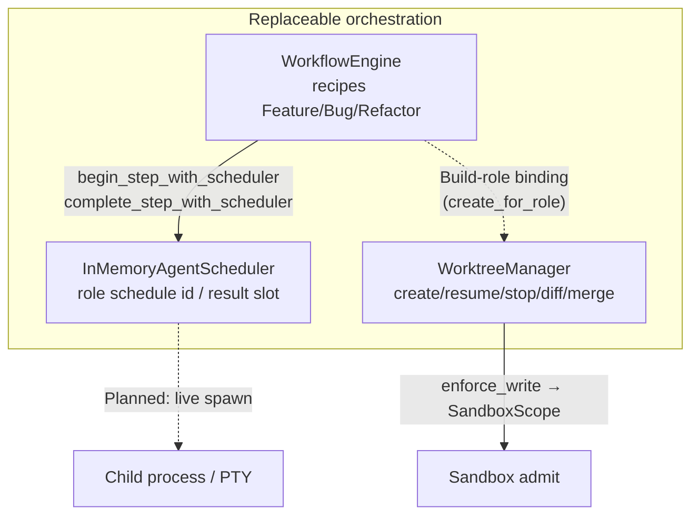
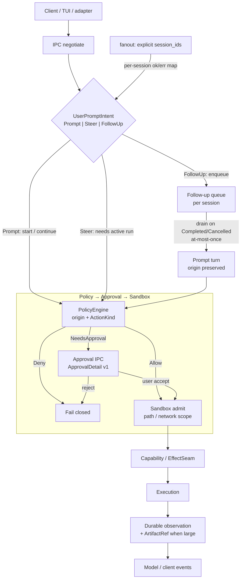

# Impetus Architecture

**Impetus** is a policy-centered local agent harness. The daemon (`impetusd`) owns
durable state; clients (`impetus`, TUI, adapters) send typed requests and render
events.

Code is the source of truth. Status labels below mean:

- **Implemented** — production path in `impetusd` / client with tests
- **Partial** — library or import path exists; not fully wired or incomplete
- **Planned** — roadmap only

## Core principles

- Durable events first: SQLite WAL event log, survive restart
- Policy-gated execution: every action goes through
  `Policy → Approval → Sandbox → Capability → Execution`
- Versioned Unix-domain IPC with capability negotiation
- Fail-closed admission: no execution when sandbox/policy denies
- Secrets only via Keychain references (macOS); never raw tokens in SQLite/logs
- Trusted kernel stays small; providers, context, extensions are replaceable layers
- Reject features whose only justification is vendor parity or feature-count optics

## Trusted kernel

```text
EventStore + DurableArtifactStore + Policy + Approval + Sandbox + Executor
```

Replaceable layers above the kernel:

```text
ProviderProtocol → ContextEngine → ToolOrchestrator
  → AgentScheduler + WorkflowEngine + WorktreeManager
  → ExtensionGateway
```

### Orchestration stack (P1)

In-memory orchestration today — recipes, role schedule handles, and worktree
lifecycle. Not a live multi-process swarm.



Module links:

- [`workflow_engine.rs`](crates/impetus-core/src/workflow_engine.rs) —
  step order, budgets, retry stub, checkpoints; scheduler hooks on begin/complete
- [`agent_scheduler.rs`](crates/impetus-core/src/agent_scheduler.rs) —
  `InMemoryAgentScheduler` (#253)
- [`worktree_manager.rs`](crates/impetus-core/src/worktree_manager.rs) —
  durable ownership + Build-role sandbox binding
- Supporting: [`subagent_metadata.rs`](crates/impetus-core/src/subagent_metadata.rs),
  [`child_concurrency.rs`](crates/impetus-core/src/child_concurrency.rs),
  [`child_result_store.rs`](crates/impetus-core/src/child_result_store.rs)

**Still Planned / open on this stack:** live agent process spawn; WorkflowEngine
cancel/replace wired to session-run intents; cross-machine orchestration.

- **AgentScheduler** — schedules agent **roles** (Explore / Research / Build / Review)
  with structured metadata and concurrency caps. Role enum +
  [`ChildRunMetadata`](crates/impetus-core/src/subagent_metadata.rs) validation
  landed (#246); global child concurrency gate
  ([`ChildConcurrencyGate`](crates/impetus-core/src/child_concurrency.rs), default
  cap 4) landed (#251); durable
  [`ChildResultStore`](crates/impetus-core/src/child_result_store.rs)
  + parent-resume gate stub (#250, labels only); in-memory role scheduler wired into
  [`WorkflowEngine`](crates/impetus-core/src/workflow_engine.rs) step begin/complete
  ([`InMemoryAgentScheduler`](crates/impetus-core/src/agent_scheduler.rs), #253 —
  schedule id / result slot, no live spawn); live process spawn still Planned.
- **WorkflowEngine** — small declarative recipes (feature/bug/refactor); owns step
  order, budgets, retry, checkpoints, cancellation, result propagation. Role-tagged
  steps record scheduler handles via `begin_step_with_scheduler` (#253). Do not
  invent a new agent type per workflow.
- **WorktreeManager** — managed git worktree lifecycle (create/resume/stop/diff/
  merge-ready/conflict/stale/close/salvage) with durable ownership and restart
  recovery; Build-role bindings attach sandbox/write permissions to the isolated
  worktree (`create_for_role` + `enforce_write`).
- **ToolOrchestrator** — JSON Schema arg validation (`tool_schema`) before
  policy/sandbox/exec; OpenAI/Anthropic HTTP requests include `tools` from
  `builtin_tool_schemas()`.
- **Hook prefilter** — cheap in-process label match
  ([`hook_prefilter`](crates/impetus-core/src/hook_prefilter.rs), #257/#272/#276)
  before any spawn stub (`AllowContinue` / `SkipSpawn` / `Deny`); rules carry
  `HookTrustLevel` (`InDaemon` / `External`); security-critical patterns require
  InDaemon — External matcher for those → clear Deny/error; catalog
  `try_new`/`add_rule` refuse exact duplicates (same pattern + action) with
  conflicting rule ids in the error — pattern subsumption YAGNI. Full
  hook/plugin ABI still Planned.
- **Built-in id hygiene** — small shipped inventory + duplicate detect
  ([`builtin_ids`](crates/impetus-core/src/builtin_ids.rs), #260); doctor
  `builtin_ids` probe; unused cross-ref stub Planned. No marketplace / vendor
  parity sprawl.

Security decisions stay in the kernel, not in ordinary plugins.

## Process topology

```text
impetus / impetus-tui / adapters
        │  versioned Unix socket (HarnessClient)
        ▼
impetusd  — authoritative daemon
  Harness (policy kernel)
  AgentLoop + ToolOrchestrator
  ProviderRegistry
  EventStore (SQLite WAL) + DurableArtifactStore
  Keychain credential resolver (macOS)
```

## Capability matrix (current)

| Area | Status | Evidence |
| --- | --- | --- |
| Durable EventStore + reconnect cursor | Implemented | `storage.rs`, IPC stream/backfill tests; local Criterion baselines in `benches/event_log.rs` + `docs/benchmarks/v0.2.md` (#16) |
| Policy `Deny \| Allow \| NeedsApproval` + origin | Implemented | `policy.rs`, `tool_orchestrator.rs` |
| PolicyConfig JSON load / reload | Partial | Format + engine/runtime reload (#193/#201); no IPC/CLI/daemon default path yet — see § Policy customization (#9) |
| Path-scope sandbox (workspace FS) fail-closed | Implemented | `effects.rs`, `tests/sandbox_fail_closed.rs` |
| macOS Seatbelt (`sandbox-exec`) in tool/process exec | Partial | Spike only: `tests/macos_sandbox_spike.rs`; **not** wired in `execution/process.rs` |
| Linux / Windows sandbox backends | Planned | Phase 9; PR CI is macOS-only |
| Keychain API-key references (macOS) | Implemented | `impetusd` `MacosKeychainResolver` |
| DurableArtifactStore (SHA-256, restart-safe) | Implemented | `durable_artifacts.rs`; tools/web/upload paths |
| Ephemeral AttachmentStore (approvals/diffs) | Implemented | `attachments.rs` — intentional, not durable |
| Process stdout/stderr → durable artifacts | Implemented | process exec stores large bodies; preview + `ArtifactRef` |
| AgentLoop vertical (read + approval write/shell) | Implemented | `agent_loop.rs`, `v05_gate` / orchestrator tests |
| Native OpenAI Chat Completions tool-call SSE | Implemented | `openai_provider.rs` + `OpenAiNativeAdapter`; `impetusd --provider-profile` |
| Native Anthropic Messages tool-call SSE | Partial | `anthropic_provider.rs` exported; not default daemon path |
| OpenAI Responses API | Partial | Opt-in `openai_http_api=responses` SSE subset; not production default |
| Legacy OpenAI-compatible text stream | Implemented | `openai_compat_adapter.rs` (still in tree; not default) |
| JSON Schema tool-arg validation (before policy) | Implemented | `tool_schema.rs` + ToolOrchestrator gate |
| Provider HTTP `tools` field | Implemented | OpenAI + Anthropic from `builtin_tool_schemas()` |
| Measured usage → budget accounting | Implemented | `record_turn_with_usage` in agent loop |
| Context HOT/WARM/COLD + lazy descriptions | Implemented | `context_optimizer.rs`, wired in `harness_api` |
| ContextBuilder (chunked artifact summarize) | Implemented | `context_builder.rs` |
| Auto LLM compaction as durable events | Partial | Threshold events exist; no auto compact in agent loop |
| Session shared-prefix fork + checkpoints | Implemented | `storage.rs`, IPC fork/checkpoint |
| Extension **import** adapters (Skills/MCP/Claude/Codex/Cursor/Plugins) | Implemented | `*_adapter.rs` + unit tests |
| Extension **runtime** in agent loop (live MCP tools, etc.) | Partial | Skills via `InstructionResolver`; MCP live tools via `McpLiveBridge` + ToolOrchestrator (no marketplace/UI) |
| Module Runtime foundation | Partial | Library + tests; not the live `impetusd` control plane |
| Web search/fetch + SSRF egress | Implemented | `web_research/` |
| Optional API search (Tavily/Exa) | Partial | `web_research/api_search.rs`: `SearchBackend` seam + mock + Keychain labels; absent/module fail-closed; no vendor HTTP crates (#264) |
| Session web outbound / private-network grants | Implemented | `SandboxScope.allow_web_outbound`, `allow_private_network` |
| Browser provider (mock negotiate/health) | Partial | Contracts + Mock/Absent + Firefox/Chrome seam modules (`real_browser.rs`); negotiate/health + navigate stub fail-closed; no compile-time binary path / CDP crates (#268) |
| Coding tools (definition/refs/diagnostics/symbols/hover) | Partial | Seam (#261) + `goto_definition` in ToolOrchestrator + IPC `coding_definition` (#267) + optional `LspBackendModule` runtime path hint (#282); mock/absent fail-closed; no real LSP process / TUI yet |
| Subagents / WorktreeManager / WorkflowEngine | Partial | `WorktreeManager` lifecycle + stale/salvage + merge-ready/conflict (#198/#206/#218); `WorkflowEngine` in-memory skeleton + Feature/Bug/Refactor recipes + per-step retry stub (#243/#254); `InMemoryAgentScheduler` wired into WorkflowEngine step path (#253 — schedule id / result slot, no live spawn); `SubagentRole` + `ChildRunMetadata` validation (#246); global `ChildConcurrencyGate` (#251); `ChildResultStore` + `gate_parent_resume` stub (#250); typed `UserPromptIntent` Prompt/Steer/FollowUp + IPC/TUI + session-run follow-up drain (`user_intent`, #247/#263/#271) + Steer rewrite seam Partial (`SteerRewrite`, #285 — live provider wire / WorkflowEngine cancel-replace still open); multi-session `fanout` with explicit ids + partial-failure map (#275 — no cross-machine / IPC yet); hook prefilter + trust levels + exact-duplicate catalog refuse (`hook_prefilter`, #257/#272/#276 — InDaemon required for security-critical; subsumption YAGNI); built-in id inventory + duplicate detect (`builtin_ids`, #260 — unused stub Planned); live agent spawn still Planned |
| Extension lifecycle (plan/apply/ownership/doctor/repair) | Partial | Dry-run + apply + state store; CLI `extension plan|install|remove|doctor|repair` |
| MemoryStore vs PolicyStore trust split | Partial | `memory_store`: no auto-promote + scopes/provenance + `redact_text` + create-only/`append` + disposable derived index / symlink-safe path resolve; human-readable source format still Planned |
| Versioned canonical schemas (`impetus.*.v1`) | Partial | Shared `schema` registry: `approval_detail` + `capabilities` + `extension`; session/mcp Planned |
| ACP as ModelProvider backend | Partial | `--acp-profile` + gateway library; not full production hardening |
| TUI (`impetus ui`) | Partial | Shell, composer, paste upload, streaming; Prompt/Steer/FollowUp composer intent (#263); more Phase 7 open |
| Zap as Impetus backend | Partial | Experimental adapter crate |
| PR CI critical security E2E suite | Partial | PR: fmt/clippy/`--lib --bins` on macOS; integration = nightly/manual |

## Request path

Typed intent routes first; mutating work still hits the kernel gate. Intent
routing never rewrites `origin` or skips Policy.



Module links:

- [`user_intent.rs`](crates/impetus-core/src/user_intent.rs) —
  `UserPromptIntent`, `UserIntentRouter`, follow-up drain, `fanout`
- [`steer_rewrite.rs`](crates/impetus-core/src/steer_rewrite.rs) —
  `SteerRewrite` seam (Partial, #285 — passthrough + mock; no live provider)
- [`policy.rs`](crates/impetus-core/src/policy.rs) —
  `PolicyEngine` / `PolicyDecision` (`Deny` | `Allow` | `NeedsApproval`)
- [`policy_config.rs`](crates/impetus-core/src/policy_config.rs) —
  JSON overrides (Partial — see [Policy customization](#policy-customization-and-approval-ui-contracts-9))
- [`approval.rs`](crates/impetus-core/src/approval.rs) —
  `ApprovalDetail` IPC UI contract (`impetus.approval_detail.v1`)

Steer targets an active run; FollowUp enqueues after the current turn. In-memory
router lives in `user_intent`; IPC `Prompt.intent` + durable `IntentEvent.intent`
and TUI `/prompt`·`/steer`·`/follow-up` are wired (#263). On session-run
Completed/Cancelled, harness drains one queued FollowUp into a Prompt turn
(origin preserved; at-most-once vs cancel race) (#271). Multi-session fanout
takes an explicit `session_ids` list through `UserIntentRouter::fanout` (#275) —
empty list rejected; each target routes independently with a per-session ok/err
map (not broadcast-by-accident; no cross-machine). Steer rewrite seam
(`SteerRewrite` / passthrough + mock; harness hook on accept) is Partial (#285).

**Still Planned / open on this path:** live provider wire for Steer rewrite;
WorkflowEngine cancel/replace on intent; fanout over IPC / cross-machine;
Seatbelt wired into process exec (spike only today).

## Storage

| Store | Durability | Use |
| --- | --- | --- |
| EventStore (SQLite WAL) | Durable | Ordered session history, approvals, budgets |
| DurableArtifactStore | Durable | Large tool/web/paste bodies (SHA-256) |
| AttachmentStore | Ephemeral (RAM) | Approval diff previews / detail DTOs |

Do not call AttachmentStore an ArtifactStore. Doctor must describe both honestly.

## Providers (truth)

Production daemon defaults to Mock, or `--provider-profile` → **native** OpenAI
Chat Completions SSE (`OpenAiProvider` + Keychain resolver) with tool-call
assembly. Legacy text-only OpenAI-compatible adapter remains in-tree for
compatibility but is not the default daemon wiring. Anthropic Messages parser
is exported. Responses API is Partial (opt-in profile field
`openai_http_api=responses`; Chat Completions stays default).

Target shape:

```text
ProviderProtocolAdapter → StreamEvent → ToolCall assembler
  → JSON Schema validation → Policy Kernel → execution
```

## Security model

1. Origin tracking: `origin=user|agent`
2. Policy before execution
3. Fail-closed sandbox admission (path scope today)
4. Keychain references only; redaction in logs/events
5. Typed approvals for mutating/sensitive ops
6. `UnknownOutcome`: no auto-retry of mutating/non-replayable work on alternate backends

## Policy customization and approval UI contracts (#9)

Classic issue #9: user **PolicyConfig** (JSON overrides) plus the versioned
**ApprovalDetail** IPC UI contract. This section indexes what exists; it does
not invent new runtime or change PolicyEngine semantics.

### PolicyConfig (format + load / reload)

JSON overrides on top of fail-closed defaults
([`policy_config.rs`](crates/impetus-core/src/policy_config.rs)):

- Document field: `version` must equal `POLICY_CONFIG_VERSION` (currently `1`)
- Optional `overrides`: map of `ActionKind` (serde snake_case) →
  `allow` | `deny` | `needs_approval`
- Parse / load: `PolicyConfig::parse`, `PolicyConfig::load_from_path`
- Apply: `PolicyEngine::with_config`, `reload_config`, `reload_config_from_path`
  (failed path reload keeps prior overrides)
- Runtime wrappers: `AgentRuntime::reload_policy_config` /
  `reload_policy_config_from_path`
- Fail-closed Denies (workspace path scope, network disabled, private-web hard
  denies) stay **ahead** of overrides — config cannot soften them
- Secrets: none in the format or fixed decision reason strings

Example:

```json
{
  "version": 1,
  "overrides": {
    "write_file": "allow",
    "spawn_process": "deny",
    "network_connect": "needs_approval"
  }
}
```

Not a shared `impetus.*.v1` registry schema today (separate `version: u32`).
Shipped under #9: format (#193), in-process reload (#201).

### ApprovalDetail IPC UI contract

`GetApprovalDetail` / `IpcResponse::ApprovalDetail` returns
[`ApprovalDetail`](crates/impetus-core/src/approval.rs) for client presentation
(diff preview, affected paths, scope estimate, attachment refs). This is a
**versioned UI contract**, not a user policy file format:

- Schema id: `impetus.approval_detail.v1`
  (`APPROVAL_DETAIL_SCHEMA_ID` / registry `SCHEMA_APPROVAL_DETAIL`)
- Payload field: `schema_version` (u16, currently `1`; omitted JSON defaults
  to v1 for backward compatibility)
- Capability: `get_approval_detail` (Hello negotiation)
- Secrets never appear in the payload — only labels/paths/opaque attachment
  UUIDs
- TUI rendering: `Overlay::Approval` / `ApprovalDetail` in `impetus-tui` (#165)

Shipped under #9: contract (#189/#191), TUI approval UI (#165/#169).

### Remaining gaps for #9

Honest list (no new runtime in this docs slice):

- Typed IPC / daemon CLI to load or reload PolicyConfig (library +
  `AgentRuntime` API only today)
- Default `impetusd` startup path that reads a user policy file
- Operator UX to edit/customize policy (out of scope for harness UI rewrite)
- Optional: register PolicyConfig in the shared `impetus.*.v1` schema registry
- Non-TUI clients (Zap adapter and others) consuming ApprovalDetail beyond the
  TUI overlay
- `PolicyStore` (memory trust model) is a **different** surface — still Partial;
  not the same as PolicyConfig action overrides

Docs index for the shipped contracts: this section (#286).

## Canonical schema registry

Shared module [`schema`](crates/impetus-core/src/schema.rs):

- Stable ids: `impetus.<name>.vN` (`SchemaSpec::id`)
- Numeric field: `schema_version` (u16)
- Registered today: `impetus.approval_detail.v1`, `impetus.capabilities.v1`,
  `impetus.session.v1` (nest-shape slice), `impetus.extension.v1`,
  `impetus.mcp.v1` (local MCP config envelope)
- Validation: version mismatch, unknown critical top-level fields, and
  leaked provider/harness keys fail clearly (`SchemaValidationError`);
  provider/harness details nest under `provider` / `harness` objects
- Lookup: `KNOWN_SCHEMAS` / `lookup_schema`
- Extension contract: [`ExtensionManifest`](crates/impetus-core/src/extension_manifest.rs)
  (`id` / `kind` / `version` / `digest` / `capabilities`) validated on
  `plan_install` for Skill + MCP config; not a marketplace
- MCP config contract: [`McpManifest`](crates/impetus-core/src/mcp_manifest.rs)
  (`id` / `transport` / `command` / `args` / `capabilities` / `env_keys`);
  env keys/labels only — never secret values; validated on `plan_mcp_config`

Session nest-shape is a slice only; full MCP JSON-RPC catalog remains out of scope.

## Documentation

- Executable roadmap: [TODO.md](TODO.md) (P0/P1/P2)
- Short phase narrative: [docs/ROADMAP.md](docs/ROADMAP.md)
- Kernel invariants: [docs/KERNEL_INVARIANTS.md](docs/KERNEL_INVARIANTS.md)
- Agent rules: [AGENTS.md](AGENTS.md)
- TUI notes: [docs/TUI_REFERENCE.md](docs/TUI_REFERENCE.md)
- Design references (principles, not copy claims): [docs/REFERENCES.md](docs/REFERENCES.md)

Historical audits under `docs/` may lag; prefer this file + `TODO.md`.
