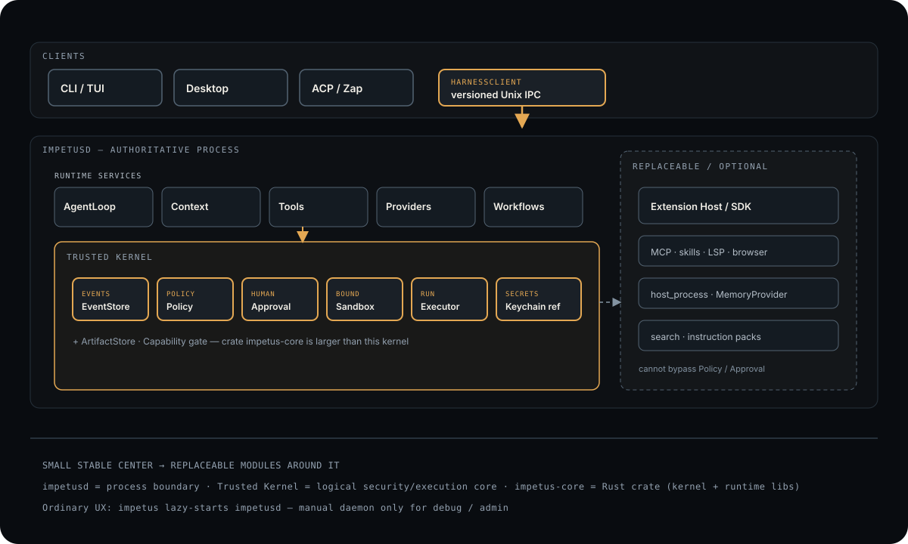

# Impetus

> Local AI-agent **runtime / harness**: a small trusted kernel, replaceable modules around it, and thin clients that never own durable authority.

[](LICENSE)
[](#architecture-at-a-glance)

<p align="center">
  
</p>

## What is Impetus?

**Impetus** is a local-first agent harness for engineering work. Sessions, policy,
approvals, sandboxing, secrets-by-reference, and execution live in one userspace
process boundary (`impetusd`). CLI, TUI, Desktop, ACP, and Zap-style UIs connect
as clients — they render and request; they do not own SQLite, Keychain, or policy.

One sentence:

**Small trusted center → replaceable providers, tools, extensions, and clients around it.**

No root / sudo / password in normal mode. Data under `$HOME` (or `IMPETUS_DATA_DIR`).
Seatbelt is userspace `sandbox-exec`. Keychain reads are silent and fail-closed.

## Principles

1. **Durable sessions** — SQLite WAL event log survives client crash and reconnect.
2. **Policy before side effects** — every action carries `origin=user|agent` and
   passes `Policy → Approval → Sandbox → Capability → Executor`.
3. **Trusted kernel stays small** — events, artifacts, policy, approval, sandbox,
   capability gate, executor, secret references. Everything else is replaceable.
4. **Versioned IPC** — clients negotiate protocol version and capabilities; mismatch
   is explicit `Incompatible`, not silent drift.
5. **Honest Absent** — unwired optional tracks (browser CDP, …) report Unavailable,
   never a fake “Available”.

## Architecture at a glance

<p align="center">
  
</p>

| Layer | Role | Examples |
| --- | --- | --- |
| **Clients** | UX only | `impetus` CLI/TUI, Desktop, ACP agents, Zap adapter |
| **Process boundary** | Authoritative runtime | `impetusd` (lazy-started by CLI) |
| **Runtime services** | Orchestration | AgentLoop, Context, ToolOrchestrator, ProviderRegistry, Workflows, Worktrees, memory/checkpoints |
| **Trusted Kernel** | Non-bypassable control | EventStore, ArtifactStore, Policy, Approval, Sandbox, Capability, Executor, Keychain refs |
| **Replaceable** | Disable / swap | model providers, MCP, skills, LSP/browser packs, host_process extensions, search |

**`impetus-core` ≠ Trusted Kernel.** The Rust crate holds kernel *and* runtime
libraries. The **Trusted Kernel** is the logical security/execution subset.
**`impetusd`** is the process that hosts both — not a separate product users must
babysit.

Deep dive: [ARCHITECTURE.md](ARCHITECTURE.md). Invariants:
[docs/architecture/kernel-invariants.md](docs/architecture/kernel-invariants.md).

### Execution flow

<p align="center">
  
</p>

(This is the admission path, not the full component map.)

## Quick Start

Supported: macOS Apple Silicon, Linux x86_64.

```zsh
curl -fsSL https://raw.githubusercontent.com/1tuz/impetus/main/scripts/install.sh | zsh
export PATH="$HOME/.local/bin:$PATH"
```

From source:

```zsh
git clone https://github.com/1tuz/impetus.git && cd impetus
task setup && cargo build --release -p impetus -p impetusd
```

Put `target/release/impetus` and `impetusd` on your `PATH` (or use `~/.local/bin`).

## Example

Ordinary use — **no manual `impetusd`**. The CLI starts the daemon if needed:

```zsh
impetus create
impetus prompt <session-id> "Summarize this repository"
impetus stream <session-id>
# When an approval is pending:
impetus approve <session-id> <approval-id>
# Or reject and continue with the denial observation:
impetus approve <session-id> <approval-id> --reject
```

TUI:

```zsh
impetus ui
```

Manual `impetusd` is for development, debugging, and advanced administration
(custom `--policy-config` / `--provider-profile` / `--acp-profile`). See
[configuration](docs/guides/configuration.md) and
[troubleshooting](docs/guides/troubleshooting.md).

## What works (code-backed)

Status labels match [ARCHITECTURE.md](ARCHITECTURE.md) (`Implemented` / `Partial`).

| Practice | Reality |
| --- | --- |
| Durable sessions + event log | SQLite WAL; reconnect replays events |
| Checkpoint / fork | Named checkpoints + shared-prefix fork IPC |
| Policy-before-execution | Typed actions through PolicyEngine |
| Human approval gate | Durable `ApprovalRequested` / `ResolveApproval` |
| Sandbox + capability | Path-scope admit; macOS Seatbelt on process spawn |
| Secret references | Keychain labels only — never raw tokens in SQLite/logs |
| Versioned IPC | Negotiate version + caps; client stores negotiated set |
| Providers | Registry + OpenAI-compatible path; ACP adapter |
| MCP | Autoload `$IMPETUS_DATA_DIR/mcp/*.json` + live reload |
| Context | HOT/WARM/COLD + lazy tool/instruction descriptions |
| Worktrees / workflows / subagents | Daemon-owned; role AgentLoop for Research/Build/Review |
| Extensions | Package SDK + host_process operate; skill packs; no marketplace |
| PTY | Daemon-owned passthrough; live handle not restart-durable |
| Browser / full LSP packs | Health/negotiate + coding_* **Implemented**; CDP / full LSP spec **Won't in core** (extensions) |

## Extension model

Trusted core stays small. Optional packs declare capabilities
(`SkillProvider`, `LspIntegration`, `BrowserIntegration`, `MemoryProvider`, …)
and speak the public host protocol (`extension/operate`). Policy and approval
remain in Impetus — an extension cannot grant itself `origin=user`.

Canonical contract: [EXTENSION_REPOSITORY_CONTRACT.md](EXTENSION_REPOSITORY_CONTRACT.md).

## Documentation

| Doc | Owns |
| --- | --- |
| [ARCHITECTURE.md](ARCHITECTURE.md) | Component matrix, ownership, honesty labels |
| [kernel-invariants.md](docs/architecture/kernel-invariants.md) | Non-bypassable pipeline |
| [reader-guide.md](docs/architecture/reader-guide.md) | Short CURRENT / TARGET map |
| [TODO.md](TODO.md) / [roadmap.md](docs/architecture/roadmap.md) | Open work |
| [docs/README.md](docs/README.md) | Guides index |
| [getting-started.md](docs/guides/getting-started.md) | Source-checkout detail |
| [SECURITY.md](SECURITY.md) | Vulnerability reporting |

## Development

```zsh
task verify   # fmt + git diff --check (default before push)
```

PR merge gate is **PR Fast** (fmt + affected `cargo check`). Deep tests run on
**Nightly Full**. See [AGENTS.md](AGENTS.md) and [CONTRIBUTING.md](CONTRIBUTING.md).

## Uninstall

```zsh
rm -f ~/.local/bin/impetus ~/.local/bin/impetusd
rm -rf ~/Library/Application\ Support/Impetus   # macOS default data dir
# Linux default: ~/.local/share/impetus
```

Remove Keychain entries via Keychain Access or `security delete-generic-password`.

## License

[Apache-2.0](LICENSE).
