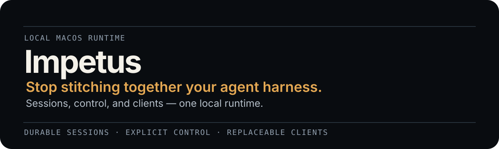
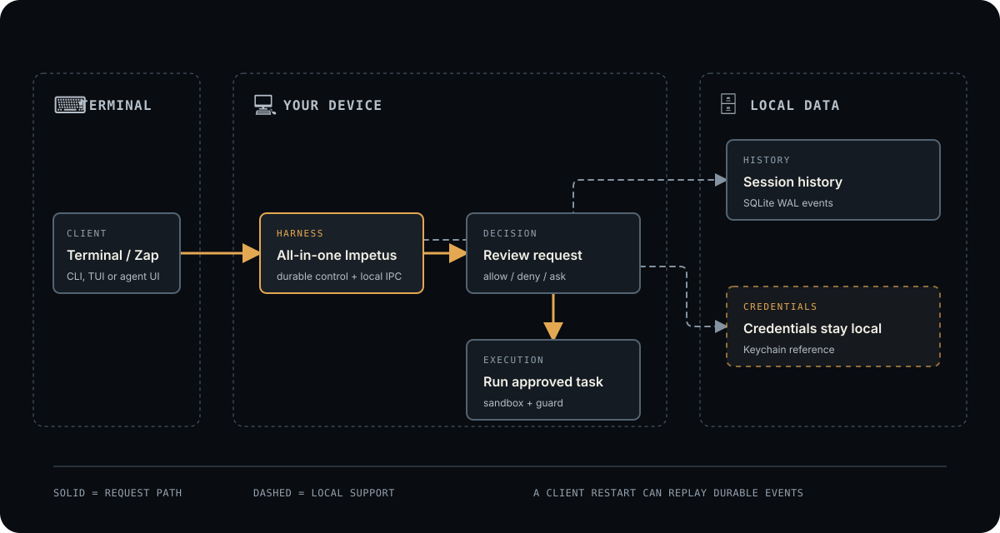

# Impetus

> **An ultra-lightweight, Rust-built, terminal-first, local-first, all-in-one agent harness for engineering.**

[](LICENSE)
[](#why-it-exists)

<p align="center">
  
</p>

Impetus is an ultra-lightweight, Rust-built all-in-one local agent harness: durable sessions, model/tool
orchestration, safety decisions, credentials, and execution authority stay
together behind replaceable terminal and remote clients. A client restart
cannot silently discard an in-flight session or expand its access.

## Why it exists

Engineering agents need long-lived state and controlled tools without making a
terminal UI, provider, or client application the source of truth. The harness
is the sole authoritative owner of durable runtime/state; clients never own
SQLite, policy, model/tool runtime, credentials, or session authority.

## Current and target

**Current.** The workspace provides the `impetus` local daemon, durable SQLite
events, versioned Unix-socket IPC, `HarnessClient`, an `impetus-cli` reference
client, direct-provider foundations, and experimental Zap adapter baseline.
`impetus-cli` is command/JSON oriented; no standalone TUI is implemented yet.

**Target.** `impetus` becomes the first-class standalone CLI/TUI for ordinary
terminals and SSH. Zap keeps its own UI and connects to Impetus as an agent
backend. Neither client path owns runtime state, and neither requires a custom
terminal emulator inside Impetus.

## What works now

- Durable sessions and ordered audit events in SQLite WAL.
- Versioned local Unix-socket negotiation before a client can act.
- Typed actions through policy, approval, sandbox, capability, and execution
  checks.
- Keychain references or a local no-secret provider endpoint; profiles never
  store raw tokens.
- Typed Rust client transport, a reference CLI, ACP gateway library, and an
  experimental Zap integration baseline.

## Request control flow

<p align="center">
  <a href="./docs/architecture-map.html">
    
  </a>
</p>

This is the request-and-safety flow, not a complete system map. The canonical
architecture explains current components, ownership, and the planned client
paths: [Architecture](ARCHITECTURE.md).

## Current development setup

Impetus currently runs from a developer checkout; it does not yet publish a
curl installer or prebuilt binaries.

```zsh
git clone https://github.com/1tuz/impetus.git
cd impetus
task setup
task verify
```

Start the daemon in one terminal. Without a provider profile, it uses the
repository's mock streaming provider.

```zsh
cargo run -p impetus
```

In another terminal, create a session and use its UUID with the reference CLI:

```zsh
cargo run -p impetus-cli -- create
cargo run -p impetus-cli -- prompt <session-id> "Summarize this repository"
cargo run -p impetus-cli -- stream <session-id>
```

For the provider-profile contract, see [configuration](docs/configuration.md).

## Planned distribution

The product distribution target is a prebuilt CLI with checksums, a curl
installer, clean-machine smoke checks, and update/uninstall documentation.
This is planned work, not an installation command today.

## Design lineage

Impetus is not a port or fork of one coding agent. It combines proven ideas
from Codex, Claude Code, OpenClaude, jcode, DeepSeek Harness, Qwen Code, Pi,
OpenCode, Aider, Kimi Code, and RTK in its own local-first Rust architecture.
See [Design references](docs/REFERENCES.md).

## Project layout

| Path | Role |
| --- | --- |
| `crates/impetus-core` | Durable events, runtime, policy, effects, providers, tools, and IPC types. |
| `crates/impetus` | Headless Unix-socket daemon and macOS Keychain resolver. |
| `crates/impetus-cli` | Current reference command-line client. |
| `crates/impetus-client` | `HarnessClient` contract and local transports. |
| `crates/impetus-zap-adapter` | Historical/experimental Zap integration baseline. |
| `crates/impetus-acp-gateway` | ACP profile and gateway library. |

## Documentation

- [Architecture](ARCHITECTURE.md) — canonical current/target architecture.
- [Roadmap](docs/ROADMAP.md) — implemented foundations and planned gates.
- [References](docs/REFERENCES.md) — design lineage, protocols, and libraries.
- [Getting started](docs/getting-started.md) — source-checkout setup.
- [Development](docs/development.md) — workspace checks and CI.
- [Implementation history](docs/IMPLEMENTATION_HISTORY.md) — retained delivery
  record; historical snapshots are not current architecture.

## Development

```zsh
task verify
```

When `Cargo.toml` or `Cargo.lock` changes, also run `task security`.

## Contributing

Read [CONTRIBUTING.md](CONTRIBUTING.md). For vulnerabilities, follow
[SECURITY.md](SECURITY.md).

## License

Licensed under [Apache-2.0](LICENSE).
