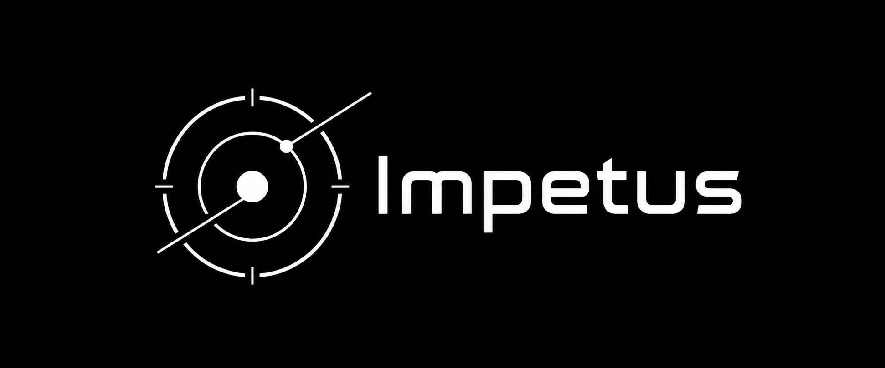

# Impetus

[Русская версия](README.ru.md)



Impetus is a local-first macOS harness for coding agents. It keeps sessions and audit events durable, routes every effect through explicit policy, and stays independent from any one terminal or GUI.

> Early-stage software. The core is usable for local development; public interfaces and integrations will evolve.

## Why Impetus

An agent runtime should not gain access merely because a model asked for it. Impetus separates the durable runtime from its clients and applies a clear decision path to every typed action:

`Policy → Allow | Deny | Needs approval → Sandbox → Capability → Execution`

- **Durable by default.** SQLite WAL stores sessions, events, approvals, and projections so a client disconnect does not discard the session state.
- **Explicit control.** Actions carry `user` or `agent` origin. Agent-originated effects cannot grant themselves approval.
- **Secret-safe boundaries.** Credentials stay in macOS Keychain; events, SQLite, logs, and client IPC use references or redacted data only.
- **Replaceable clients.** The headless runtime, Unix-socket protocol, CLI, and optional native client have separate responsibilities.

## Architecture

```
Clients (CLI, Zap adapter, TUI, GPUI)
  │ typed IPC protocol
  ▼
Unix socket daemon
  │ versioned capability negotiation
  ▼
Harness
  │ per-session coordination (A3)
  ├─ trusted origin derivation (A2)
  ├─ policy → approval → sandbox
  ├─ admitted operation enforcement (A1)
  └─ capability → execution
  ▼
EventStore (SQLite WAL)
  └─ durable events, ordered projection
```

See [ARCHITECTURE.md](docs/ARCHITECTURE.md) for details.

## Current scope

**Implemented (v0.1–v0.6, A1–A3):**
- Headless daemon with versioned Unix-socket IPC
- Reference CLI (create/attach/stream/cancel sessions)
- Durable event store (SQLite WAL)
- Policy engine + approval system
- OpenAI-compatible provider streaming
- Keychain-backed credentials
- Bounded workspace read-only tools
- Controlled process/PTY execution (type-level admission enforcement)
- SSH profiles with host-key verification
- Per-session coordination (no global lock)
- Server-side origin derivation
- Deferred effect storage for approval continuation

**In progress (B1):**
- Typed client SDK (no raw IpcResponse enum matching)
- Event-driven push subscription (no poll loops)

**Planned:**
- Complete DTOs (attachment/diff/detail endpoints)
- Provider registry/metadata
- Durable budgets
- Real remote executor (SSH/SFTP/PTY/tmux)
- MVP UI (session management, search, notifications)

See [ROADMAP.md](docs/ROADMAP.md) for phased plan.

## Quick start

Requirements: macOS, Rust `1.98.0`, Xcode Command Line Tools.

```zsh
task setup
task verify
```

Run the harness:

```zsh
cargo run -p impetus
```

Create a session from another terminal:

```zsh
cargo run -p impetus-cli -- create
```

Use `cargo run -p impetus-cli -- --help` for available commands.

## Zap integration

Zap is not required by Impetus and does not own its policy, state, or secrets. Today, Impetus runs from a normal Zap tab. A dedicated adapter with structured blocks and typed approvals is planned.

## Testing

```zsh
cargo test --workspace  # 247 tests
cargo clippy --workspace --all-targets -- -D warnings
cargo fmt --check
```

Integration tests cover:
- Process execution (12 tests)
- Remote profiles (26 tests: SSH, PTY, tmux, SFTP)
- Policy replay and fail-closed sandbox
- A1/A2/A3 regression gates

## Influences

Impetus draws specific ideas from several projects:

- [Zap](https://github.com/zerx-lab/zap): local-first terminal UX
- [DeepSeek Harness](https://github.com/deepseek-ai/deepseek-harness): capability seams, append-only traces
- [Agent Client Protocol](https://agentclientprotocol.com/): external agent adapters
- [Claude Code](https://code.claude.com/): explicit permission modes
- [GPUI-CE](https://github.com/gpui-ce/gpui-ce): optional native macOS client

See [REFERENCES.md](docs/REFERENCES.md) for detailed notes.

## Documentation

- [Architecture](docs/ARCHITECTURE.md) — system design and components
- [Roadmap](docs/ROADMAP.md) — phased development plan with gates
- [Current Architecture Audit](docs/current-architecture-audit.md) — status snapshot
- [Implementation History](docs/IMPLEMENTATION_HISTORY.md) — completed phases (A1-A3, v0.6)
- [Agent Rules](AGENTS.md) — repository conventions for coding agents

## License

[Apache-2.0](LICENSE)
