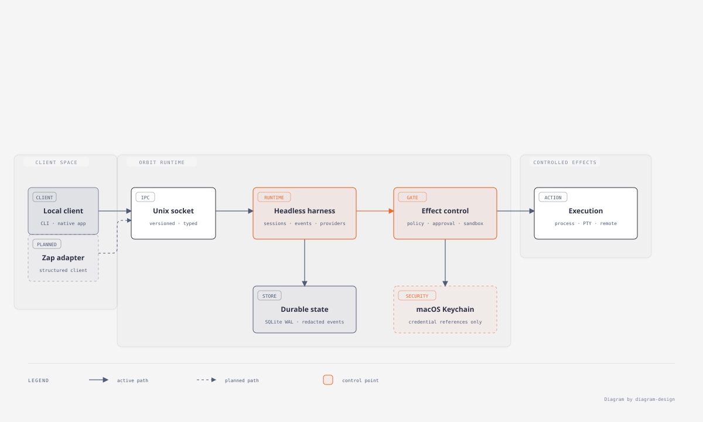

# Orbit

[English version](README.md)

Orbit — local-first harness для coding-агентов на macOS. Он сохраняет сессии и события аудита, проводит каждое действие через явную policy и не зависит от конкретного terminal-клиента или GUI.

> Ранняя стадия. Ядро уже подходит для локальной разработки, но публичные интерфейсы и интеграции будут меняться.



Схема архитектуры создана с помощью [diagram-design](https://github.com/cathrynlavery/diagram-design).

## Зачем Orbit

Модель не должна получать доступ только потому, что она его запросила. Orbit отделяет durable runtime от клиентов и применяет единый путь принятия решения к каждому типизированному действию:

`Policy → Allow | Needs approval | Deny → Sandbox → Capability → Execution`

- **Долговечное состояние.** SQLite WAL хранит сессии, события, approvals и projections: отключение клиента не теряет состояние сессии.
- **Явный контроль.** У действия есть origin `user` или `agent`; действие агента не может само себе выдать approval.
- **Граница секретов.** Учётные данные остаются в macOS Keychain; в событиях, SQLite, логах и IPC — только ссылки или отредактированные данные.
- **Сменные клиенты.** Headless runtime, Unix-socket protocol, CLI и optional native client разделены по ответственности.

## Что есть сейчас

- Headless daemon с versioned local Unix-socket IPC и согласованием capabilities.
- Reference CLI: создать сессию, подключиться, читать поток событий, отправлять prompt и отменять run.
- Durable event store, policy и approvals, ограниченные workspace read-only tools и controlled process/PTY capabilities.
- Явные local или OpenAI-compatible provider profiles; Keychain credential читается только при запросе к provider.

## Быстрый старт

Нужны macOS, Rust `1.98.0` и Xcode Command Line Tools. Optional native client также требует Metal.

```zsh
task setup
task verify
```

В одном terminal запусти harness:

```zsh
cargo run -p impetus
```

В другом создай сессию:

```zsh
cargo run -p agentic-terminal-cli -- create
```

Доступные команды сессий: `cargo run -p agentic-terminal-cli -- --help`.

## Интеграция с Zap

Zap не обязателен для Orbit и не владеет его policy, состоянием или секретами. Сейчас Orbit можно запускать в обычной вкладке Zap. Дальше мы хотим развить выделенный adapter: он будет показывать typed status, output, diffs и approval requests, не размывая границу runtime.

## Источники идей

Orbit развивается самостоятельно, используя отдельные идеи из нескольких проектов и протоколов:

- [Zap](https://github.com/zerx-lab/zap): local-first terminal UX и направление будущего structured client adapter.
- [DeepSeek Harness](https://github.com/deepseek-ai/deepseek-harness): capability seams, manifests и append-only traces.
- [Agent Client Protocol](https://agentclientprotocol.com/): граница для adapters к внешним coding-агентам, session updates и согласования capabilities.
- [Claude Code](https://code.claude.com/): явные permission modes и fail-closed подход к безопасности.
- [GPUI-CE](https://github.com/gpui-ce/gpui-ce) и [Zed GPUI examples](https://github.com/zed-industries/zed/tree/main/crates/gpui/examples): optional native macOS reference client.

В [списке референсов](docs/REFERENCES.md) зафиксировано, что именно вдохновило Orbit и какие границы остаются принципиальными.

## Материалы проекта

- [Схема архитектуры](docs/orbit-architecture.html)
- [Roadmap](docs/ROADMAP.md)
- [Список референсов](docs/REFERENCES.md)
- [Правила для coding-агентов](AGENTS.md)

## Лицензия

[Apache-2.0](LICENSE)
